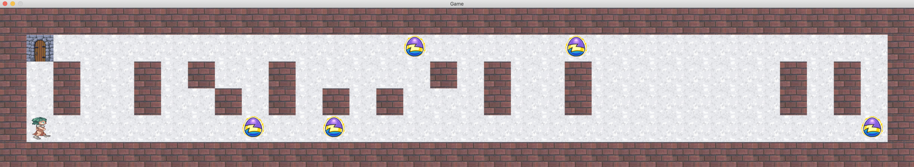

# so_long
## Introduction to so_long
So_long is an individual project that requires us to create a small 2D game with minilibx. You'll learn about textures, sprites and tiles.

### Description
This project is about creating your very first game using Mlx.

# How to play ?
- You need to compile  source files with `make ` for mandatory part and `make bonus` for bonus part.
- To launch the game, execute `./so_long includes/maps/map.ber` or `./so_long_bonus includes/maps/map1.ber`
You are free to make your own map ;).

# PREVIEW
- MANDATORY

- BONUS

